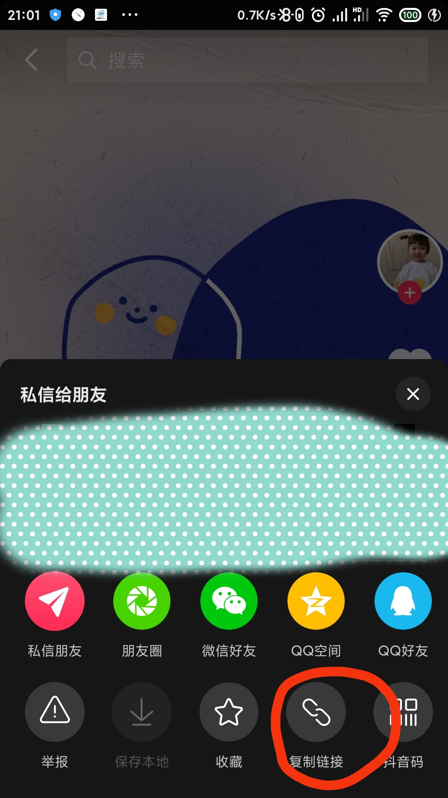

# MediaQuickAndroid
## 介绍
```text
一款能快速识别解析出抖音快手的无水印视频、图片的软件。
支持解析内容：
	抖音：单个视频、相册
	快手：单个视频、相册
    微博：单个视频
    网易云音乐：单个视频
解析方式：
	安卓10以下：程序启动后，支持任何位置复制抖音、快手链接到剪切板进行解析
	安卓10及以上：程序输入框粘贴分享链接解析
```

## 接口
接口使用   [MediaQuickServer V1.3](https://github.com/zbfzn/MediaQuickServer/tree/v1.3)

## 使用
快速使用：下载[MediaQuick-lateast](https://github.com/zbfzn/MediaQuickAndroid/releases/download/v0.8/MediaQuick-v0.8.apk) 版本直接安装使用
  
首次进入需要设置解析接口地址，填入MediaQuickServer接口地址即可（例如：http://127.0.0.1:7899/media/quick/v1/media/parse）。  

#### 创作不易，给个star呗(✪ω✪)  
## 注意
<font style="color: #ff0000">本软件仅供学习交流使用。 如用本程序于非法用途所导致的后果自负,与作者无关。</font>  

## 示例



